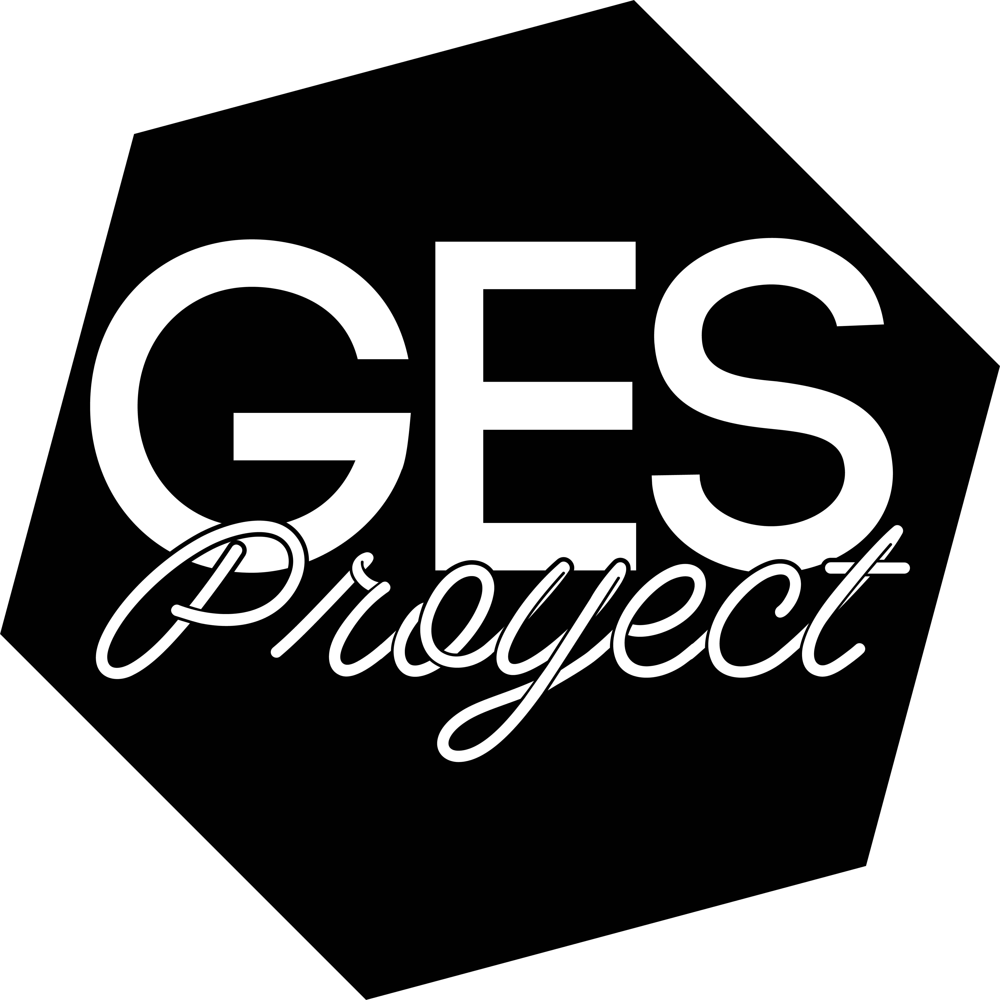

# GESPROYECT

1. Tener instalado NodeJS, MongoDB y AngularCLI
2. Si ya esta intalado esto corre el codigo `npm install`
3. Cuando este listo ejecuta codigo `npm run dev`
4. Abrir **localhost:4200**
----------

